**Ethical Gearz - Empowering Ethical Hackers Everywhere**

[Ethical Gearz](https://www.ethicalgearz.com/) is a full ecommerce site that specializes in selling top-of-the-line hacking gear to customers around the world. The site is built using Django, Python, HTML, CSS, and JavaScript, and utilizes Stripe as its payment processor.

    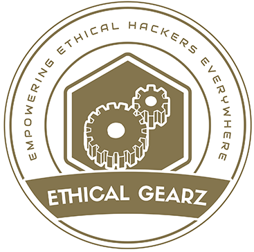

This was my fifth project for the Code Institute's [Full Stack Software Development Diploma](https://codeinstitute.net/ie/full-stack-software-development-diploma/).

# User Experience

## Strategy Plane

### Site Goals

Ethical Gearz website is a Business to Consumer (B2C) e-commerce site that sells ethical hacking software, tools and equipment.

We are excited to introduce Ethical Gearz - an ecommerce store catering to individuals and organizations interested in cybersecurity and ethical hacking. Our primary goal is to provide a range of ethical hacking products suitable for hackers of all levels, at different price points, all in one place. Our aim is to create a platform for people interested in ethical hacking, which aligns with the principles of responsible hacking and contributes to the development of the cybersecurity community. With a strong focus on responsible and ethical hacking, we strive to provide a safe and reliable space for our customers to purchase the necessary tools and equipment for their ethical hacking projects.

As cybersecurity threats continue to increase, and more businesses are becoming targets, the need for ethical hacking has become more important than ever. Ethical Gearz seeks to provide a platform that promotes the ethical use of hacking tools and equipment, raises awareness about cybersecurity issues, and educates customers on how to stay safe and secure online.

### Marketing Strategies

**Ethical Gearz advocates for responsible and ethical hacking practices.**

As a result, our marketing strategy is focused on creating a community of like-minded individuals and organizations who share this belief.

Our goal is to establish Ethical Gearz as a reliable source of ethical hacking tools and resources, as well as to build a platform where ethical hackers of all levels can connect, share knowledge and experiences, and collaborate on ethical hacking projects.

To accomplish this, we will employ a combination of digital marketing tactics and targeted outreach to engage our target audience and establish a strong brand identity, which are outlined below:

**Educational content:** Create and publish content that educates the audience about the importance of ethical hacking and cybersecurity. This can include blog posts, social media posts, and videos that provide information about the latest security threats and ethical hacking techniques.

**Social media:** Utilize social media platforms such as Twitter, LinkedIn, and Facebook to connect with the cybersecurity community and promote Ethical Gearz as a reliable source for ethical hacking tools and resources.

**Referral program:** Offer a referral program to incentivize customers to share their positive experiences with Ethical Gearz with their friends and colleagues. This can help to expand the customer base and build trust in the brand.

**Partnerships:** Partner with ethical hacking and cybersecurity influencers, bloggers, and organizations to reach a wider audience and gain credibility in the industry.

**Ethical messaging:** Emphasize the ethical aspect of the business in all marketing efforts. Use messaging that highlights the importance of responsible hacking and the role Ethical Gearz plays in promoting ethical hacking practices.

**Discounts and promotions:** Offer discounts and promotions on ethical hacking products and services to attract customers and build loyalty.

**Customer reviews:** Encourage customers to leave reviews on the website and other review platforms to build social proof and credibility in the industry.

To promote responsible and ethical hacking, we will implement a marketing strategy that will make use of various digital marketing channels.

This includes SEO to increase the visibility and reach of our website, brand awareness and recognition, content marketing to provide useful information and resources to our target audience, social media marketing to engage with our followers and promote our brand, and email marketing with Mailchimp to keep our subscribers up to date on our latest products and promotions.

We hope to establish Ethical Gearz as a reliable source of ethical hacking tools and resources, as well as to contribute to the growth of the cybersecurity community, by utilizing these marketing channels.

#### Brand Awareness

Brand awareness is a key component of our marketing strategy at Ethical Gearz. We aim to establish a strong brand identity by using consistent branding elements such as a professional logo and slogan, and a brand-named domain name. By utilizing these elements across all marketing channels, we hope to increase brand recognition and establish Ethical Gearz as a trusted and reliable source for ethical hacking tools and resources. We will also prioritize customer satisfaction, as positive reviews and word-of-mouth recommendations are essential for building and maintaining a strong brand reputation.

#### Brand Recognition

For our marketing strategy, we will focus on building brand recognition by using a professional logo and slogan and a branded domain name, ethicalgearz.com. This will help to establish our brand identity and make it easier for customers to remember us. We will also ensure that our branding is consistent across all marketing channels to increase recognition and make our brand more memorable.

Pic of Logo
domain name

#### Search Engine Optimization

A key strategy for improving the visibility of Ethical Gearz in search engine results pages is search engine optimization (SEO). One important step in this process was creating a dedicated domain for the website, which is ethicalgearz.com, to improve indexing by search engines. By using ethicalgearz.com as our domain, we will increase the chances of our site appearing higher in search results when users search for keywords related to ethical hacking and cybersecurity. This will help us reach a wider audience and ultimately drive more traffic to the site.

Picture of SEO

#### Content Marketing

Content marketing for Ethical Gearz involves creating and sharing informative and engaging content related to ethical hacking and cybersecurity. This content could take the form of blog posts and infographics. The goal of content marketing is to attract and retain a clearly defined audience, and ultimately, to drive profitable customer action. By providing valuable and educational content on the site, Ethical Gearz can establish itself as a trusted resource for ethical hackers of all levels, and build a loyal following over time.

Picture of Content Marketing

#### Social Media Marketing

Ethical Gearz will utilize Facebook and LinkedIn as social media marketing platforms to promote our brand and products. We will engage with our audience by sharing informative and educational content related to ethical hacking and cybersecurity, highlighting our products, and encouraging discussion and feedback. Through these platforms, we aim to build a strong community of individuals and organizations interested in ethical hacking and cybersecurity.

Picture of Facebook Page

Picture of LinkedIn Page

#### Email Marketing

Ethical Gearz will utilize Mailchimp as our email marketing platform to reach our audience with relevant content, promotions, and updates. With Mailchimp's robust features, we will be able to target specific segments of our audience, personalize our messages, and track the success of our campaigns. This will allow us to build strong relationships with our customers and keep them engaged with our brand.

Picture of Mailchimp
Link to Newsletter Signup

### Agile Planning

The project was developed using agile practices, with small features delivered in incremental sprints over a 5 week period. Issues were organized into milestones and prioritized using labels such as "must have," "should have," "could have," and "nice to have."

These milestones were divided into sprints based on six milestones, with "must have" stories being completed first, followed by "should have" stories, and finally "could have" and "nice to have" stories. This prioritization ensured that all essential requirements were completed first, providing a solid foundation for the application and allowing for the addition of must-have features.

GitHub Projects was used to create a Kanban board, which can be found [here](https://github.com/users/mickymacirl/projects/3/views/1). Each story, such as the documentation milestones, is an issue. Each story contains a description of the relevant acceptance criteria that must be fulfilled. There is a "won't do" option for any features that are not implemented.

## Scope Plane

## Structure Plane

## Skeleton Plane

### Home Page

### Products Page

### Product Detail Page

### Shopping Basket Page

### Check Out Page

### Check Out Payment Overlay

### Check Out Success Page

### User Profile Page

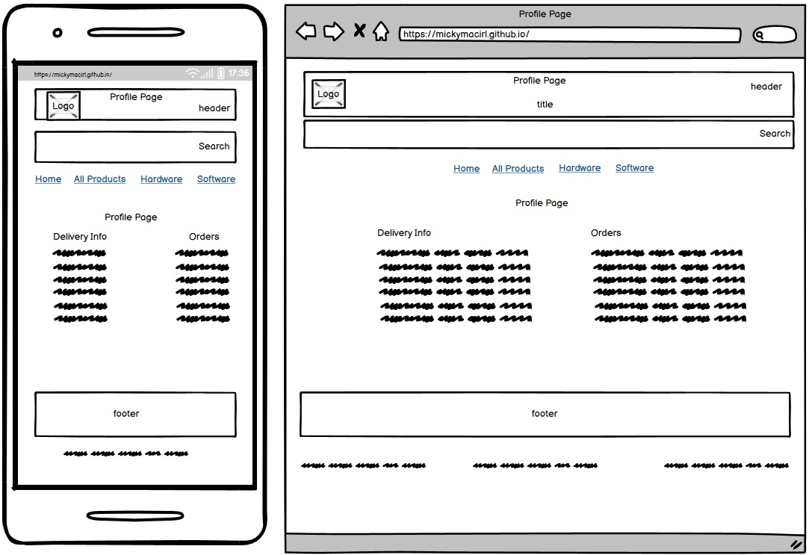

### Contact Us Page

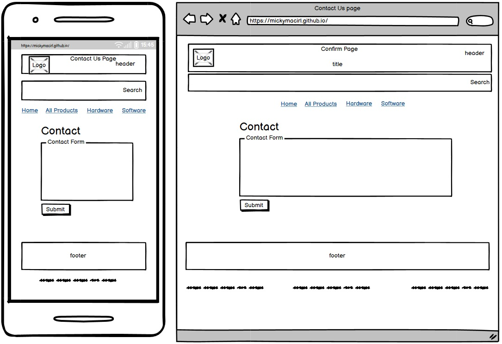

### Confirm Page

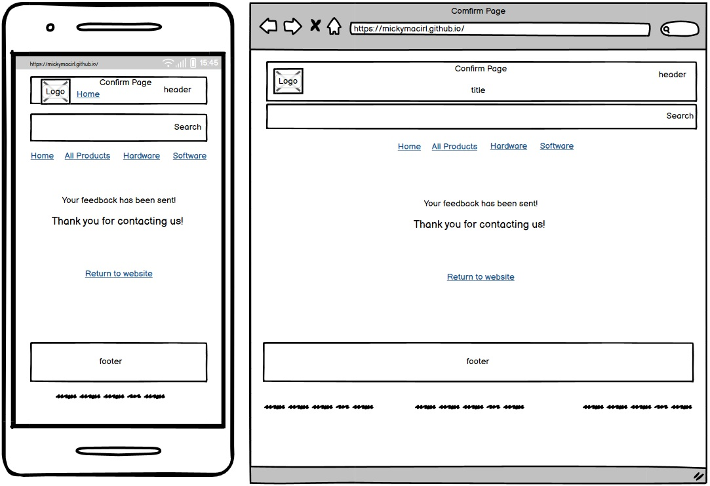

### 404 Error Page

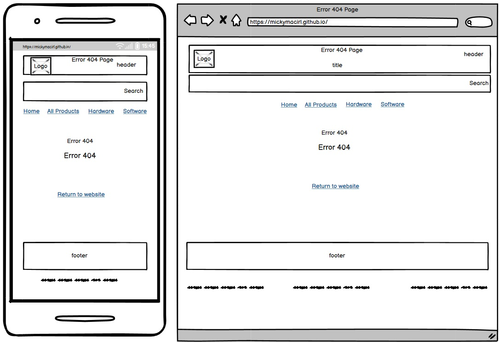

### 403 Error Page

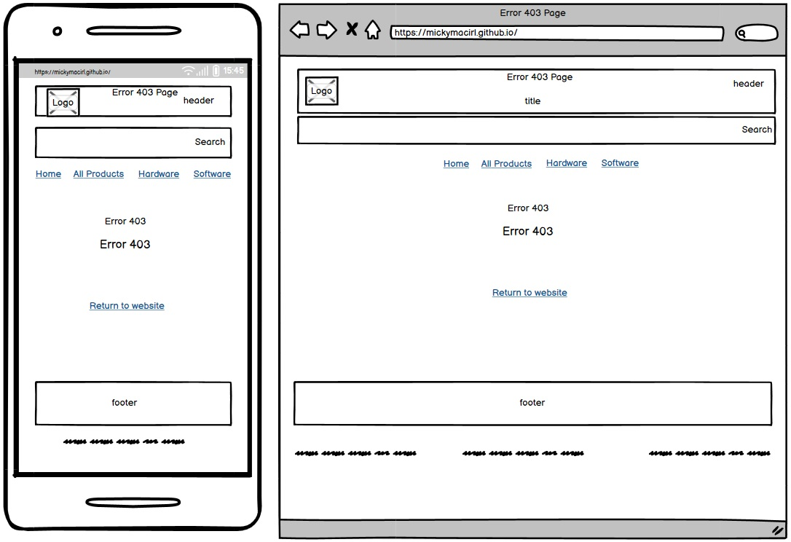

### 500 Error Page

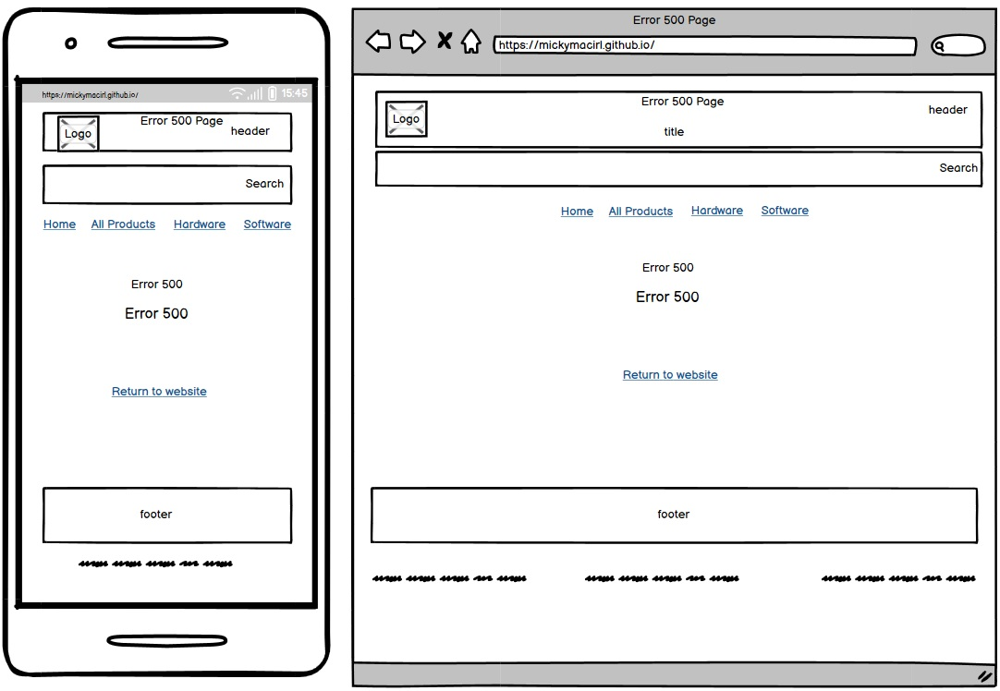

### GDPR Policy Page

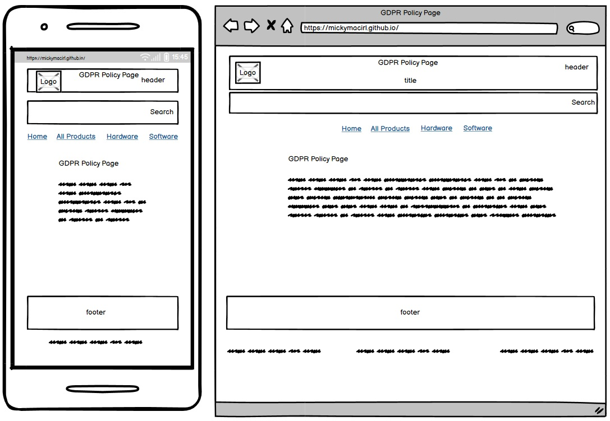

### Terms and Conditions Page

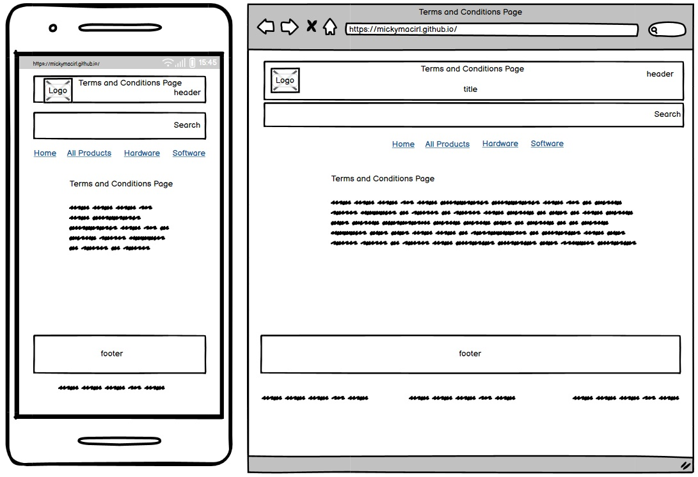

### Privacy Policy Page

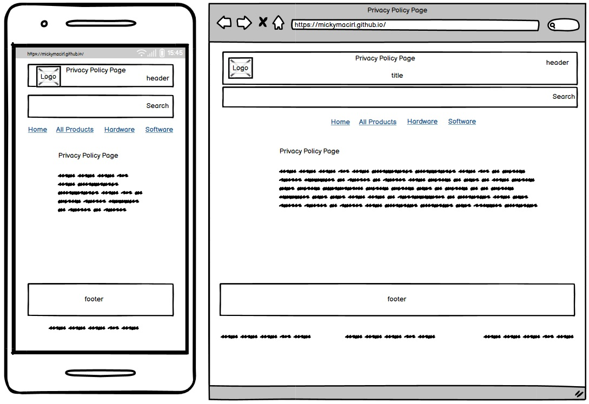

### Delivery Policy Page

### Ethical Behavior Policy Page

### Administor Website Management Page

### Administor Product Admin Page

### Register Page

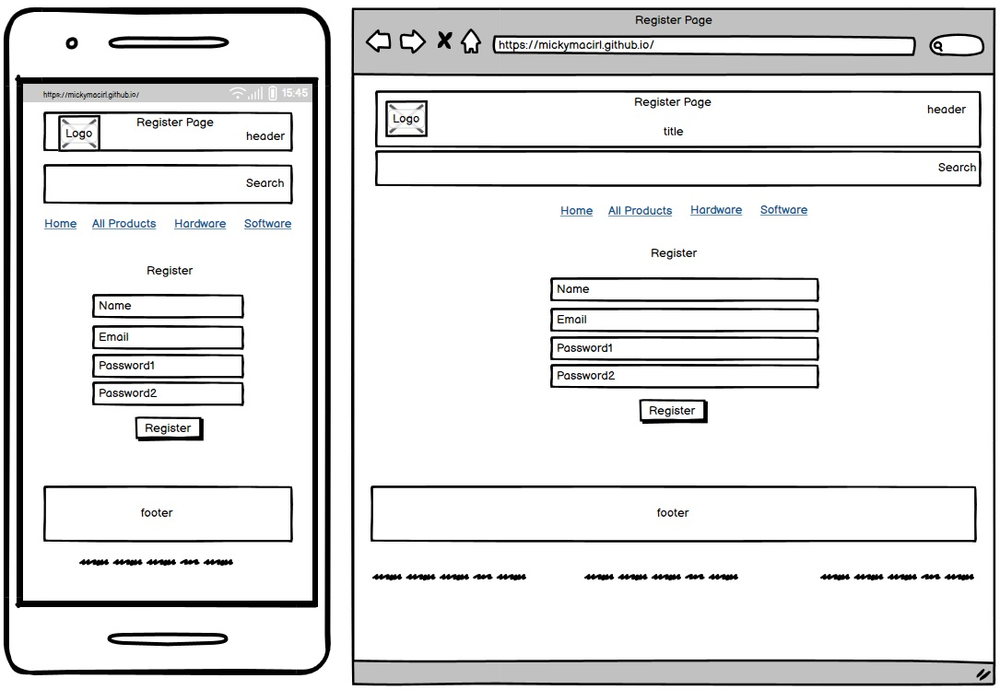

### Login Page

### Verify Email Page

### Logout Page

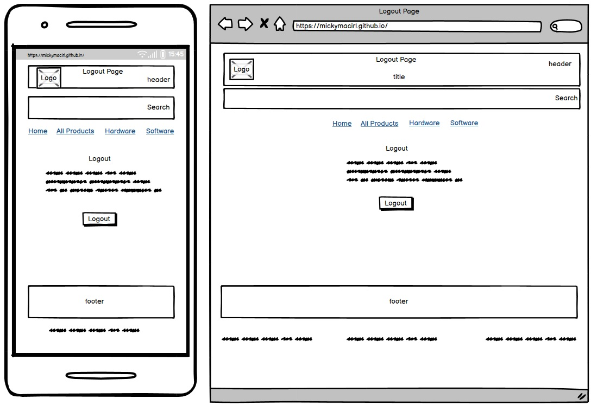

### Forgot Password Page

### Change Password Page

### Change Password Success Page

## Surface Plane

## Design

### Logo

Logo designed using Smashing Logos with references to cyber security topics.

### Color Scheme

The website's primary color scheme is white on white. To match the color of the logo,  were added to borders, button text, and hover effects.

### Typography

Throughout the website, the *[Font 1](https://fonts.google.com/specimen/)* font was used. This font was imported into the style sheet from Google Fonts.

Logo fonts are:

### Font 1

### Font 2

### Imagery

Logo created from *[Smashing Logos](https://smashinglogo.com)* to design logo, icons and favicon.

Used Abode Photoshop to edit the main hero image with the logo in the circles from *[Circle Tech](https://test/)*. and the main banner image with logo text and icon.

### Wireframes

# Features

## Features of the website

### Navbar

### Footer

### Favicon

### Defensive Application

Defensive Application programming techniques were utilized in the development of this website to ensure that only authorized administrators were given access to sensitive features. This was done to prevent unauthorized access and ensure the integrity of user data. Appropriate authentication and authorization mechanisms were put in place as part of these techniques. By doing so, the website was made more secure and less vulnerable to potential security breaches.

### Home Page

### Products Page

### Product Detail Page

### Shopping Basket Page

### Check Out Page

### Check Out Payment Overlay

### Check Out Success Page

### User Profile Page

### Contact Us Page

### 404 Error Page

### 403 Error Page

### 500 Error Page

### GDPR Policy Page

### Terms and Conditions Page

### Privacy Policy Page

### Delivery Policy Page

### Ethical Behavior Policy Page

### Administor Website Management Page

### Administor Product Admin Page

### Register Page

### Login Page

### Verify Email Page

### Logout Page

### Forgot Password Page

### Change Password Page

### Change Password Success Page

# Technology

## HTML

* The main structure of the website was developed using HTML as the main language.

## CSS

* The webpage was styled using bootstrap and custom css.

## Python

* Python was used with the Django framework.

## Adobe Photoshop

* Used *[Adobe Photoshop](https://www.adobe.com/products/photoshop.html)* for image preperation including facebook and linkedin mockups.

## Adobe Dreamweaver

* The website tested and designed using *[Adobe Dreamweaver](https://www.adobe.com/products/dreamweaver.html)*.

## PyCharm

* The website was developed using *[PyCharm](https://www.jetbrains.com/pycharm/)*.

## GitHub

* Source code is on GitHub.

## Git

* Used to commit and push code during the development of the website.

## Font Awesome

* Used for icons and fonts.

## Balsamiq

* The wireframes were created using Balsamiq.

## TinyPNG

* TinyPNG is was used to reduce image sizes to improve lighthouse scores.

# Deployment

# Testing

# Credits

## Design Website

* Used *[Smashing Logos](https://smashinglogo.com)* to design logo, icons and favicon.

* Used *[Color Hunt](https://colorhunt.co/)* to help with color design.

* Used *[Name that color](https://chir.ag/projects/name-that-color/)* for name colors.

* Used *[Color Wheel](https://www.canva.com/colors/color-wheel/)* for color compatibility.

## Facebook Mockup Template

* Used *[Design Bolts](https://www.designbolts.com/2018/07/19/new-free-facebook-business-profile-page-mockup-psd-2018/)* to design Facebook Business Profile Page mockup.

## LinkedIn Mockup Template

* Used *[Freebie SUI](https://freebiesui.com/free-psd/psd-mockups/free-linkedin-mockups/)* to design LinkedIn Business Profile Page mockup.

## Brand Recognition vs Brand Awareness

* Used *[Fabrik Brands](https://fabrikbrands.com/brand-recognition-or-brand-awareness/)* for reference to the different types of Brand Marketing.

## GDPR Policy

* Used *[GDPR Policy Generator](https://www.gdprprivacynotice.com/)* to generate a base GDPR policy temple.

## Privacy Policy

* Used *[Privacy Policy Generator](https://www.privacypolicygenerator.info/)* to generate a base privacy policy template.

## Hak5.org

* Used *[Hak5.org Web Store](https://www.privacypolicygenerator.info/)* for product ideas and help in understanding ethical marketing and marketing strategy.

## Ethical Behavior Policy

* Used *[Simple Learn Ethical Hacking](https://www.simplilearn.com/tutorials/cyber-security-tutorial/what-is-ethical-hacking)* for Ethical Behavior Policy outline.

## Terms and Conditions Policy

* Used *[Terms and Conditions Policy Generator](https://www.termsandconditionsgenerator.com/)* to generate a base Terms and Conditions policy temple.

## Shopify Marketing Blog

* Used *[Shopify Marketing Blog](https://www.shopify.com/ie/blog/ecommerce-marketing)* as reference for ecommerce marketing strategy.

# Acknowledgements

* Mentor support from *[Daisy McGirr](https://github.com/Daisy-McG)*.

* Daisy's brilliant YouTube Channel at *[Dee Mc](https://www.youtube.com/channel/UCS9urT8R0LAgqrhzeG9qI0Q)* used for reference and project planning.
