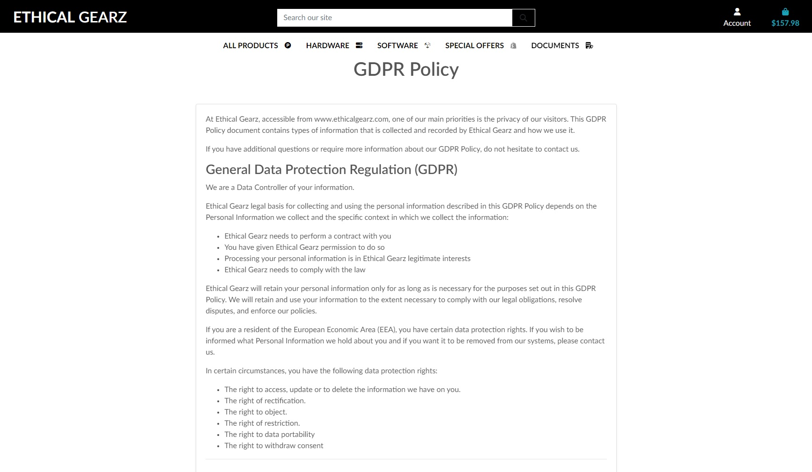
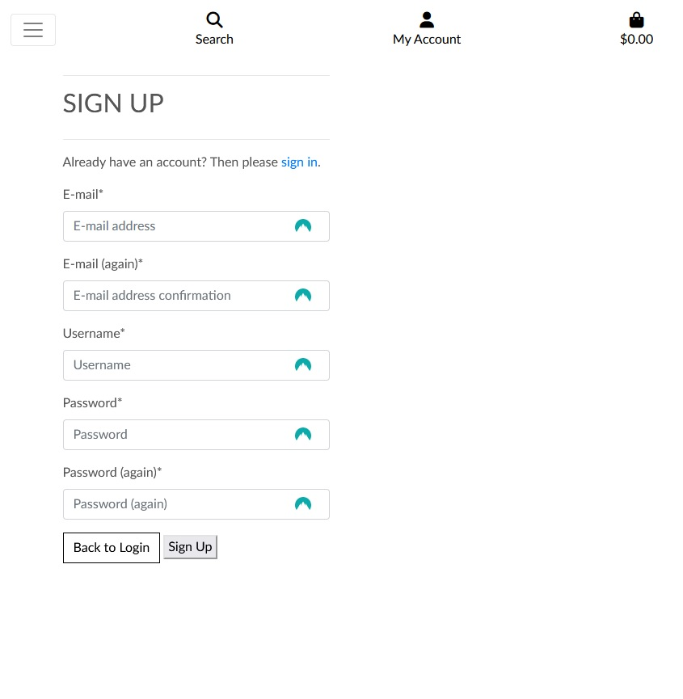
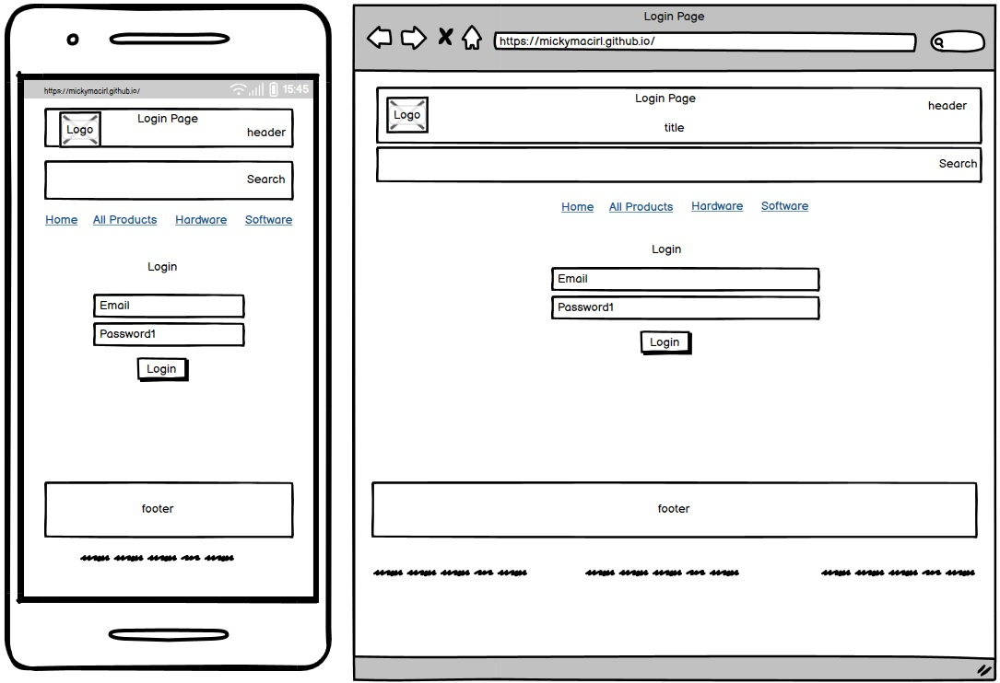

**Ethical Gearz - Empowering Ethical Hackers Everywhere**

[Ethical Gearz](https://www.ethicalgearz.com/) is a full ecommerce site that specializes in selling top-of-the-line hacking gear to customers around the world. The site is built using Django, Python, HTML, CSS, and JavaScript, and utilizes Stripe as its payment processor.

    

Live site is *[here](https://ci-p5-egz.herokuapp.com/)* and the forwarded site from *[EthicalGearz.com](https://ci-p5-egz.herokuapp.com/)*

This was my fifth project for the Code Institute's [Full Stack Software Development Diploma](https://codeinstitute.net/ie/full-stack-software-development-diploma/).

<!-- TOC start (generated with https://github.com/derlin/bitdowntoc) -->

- [User Experience](#user-experience)
  - [Strategy Plane](#strategy-plane)
    - [Site Goals](#site-goals)
    - [Marketing Strategies](#marketing-strategies)
      - [Brand Awareness](#brand-awareness)
      - [Brand Recognition](#brand-recognition)
      - [Search Engine Optimization](#search-engine-optimization)
      - [Content Marketing](#content-marketing)
      - [Social Media Marketing](#social-media-marketing)
        - [Facebook Page](#facebook-page)
        - [LinkedIn Page](#linkedin-page)
      - [Email Marketing](#email-marketing)
  - [Agile Planning](#agile-planning)
    - [Milestones](#milestones)
    - [User Stories](#user-stories)
      - [Milestone 1 - Basic Setup](#milestone-1---basic-setup)
      - [Milestone 2 - Stand Alone Pages Setup](#milestone-2---stand-alone-pages-setup)
      - [Milestone 3 - Authentication Setup](#milestone-3---authentication-setup)
      - [Milestone 4 - Admin Setup](#milestone-4---admin-setup)
      - [Milestone 5 - Stripe](#milestone-5---stripe)
      - [Milestone 6 - Additional Features](#milestone-6---additional-features)
      - [Milestone 7 - Documentation](#milestone-7---documentation)
  - [Scope Plane](#scope-plane)
  - [Structure Plane](#structure-plane)
  - [Features of the website](#features-of-the-website)
    - [Navbar](#navbar)
    - [Defensive Application](#defensive-application)
    - [Home Page](#home-page)
    - [Products Page](#products-page)
    - [Product Detail Page](#product-detail-page)
    - [Shopping Basket Page](#shopping-basket-page)
    - [Check Out Page](#check-out-page)
    - [Check Out Success Page](#check-out-success-page)
    - [User Profile Page](#user-profile-page)
    - [Contact Us Page](#contact-us-page)
    - [404 Error Page](#404-error-page)
    - [GDPR Policy Page](#gdpr-policy-page)
    - [Privacy Policy Page](#privacy-policy-page)
    - [Delivery Policy Page](#delivery-policy-page)
    - [Ethical Behavior Policy Page](#ethical-behavior-policy-page)
    - [Administor Post Management Page](#administor-post-management-page)
    - [Administor Product Admin Page](#administor-product-admin-page)
    - [Register Page](#register-page)
    - [Login Page](#login-page)
    - [Verify Email Page](#verify-email-page)
    - [Logout Page](#logout-page)
    - [Forgot Password Page](#forgot-password-page)
    - [Change Password Page](#change-password-page)
    - [Change Password Success Page](#change-password-success-page)
  - [End of Project Review and Kanban Board](#end-of-project-review-and-kanban-board)
    - [Milestone 1](#milestone-1)
    - [Milestone 2](#milestone-2)
    - [Milestone 3](#milestone-3)
    - [Milestone 4](#milestone-4)
    - [Milestone 5](#milestone-5)
    - [Milestone 6](#milestone-6)
    - [Milestone 7](#milestone-7)
    - [End of Project Comments](#end-of-project-comments)
  - [Future Features](#future-features)
  - [Skeleton Plane](#skeleton-plane)
    - [Wireframes](#wireframes)
      - [Home Page Wireframe](#home-page-wireframe)
      - [Products Page Wireframe](#products-page-wireframe)
      - [Product Detail Page Wireframe](#product-detail-page-wireframe)
      - [Shopping Basket Page Wireframe](#shopping-basket-page-wireframe)
      - [Check Out Page Wireframe](#check-out-page-wireframe)
      - [Check Out Success Page Wireframe](#check-out-success-page-wireframe)
      - [User Profile Page Wireframe](#user-profile-page-wireframe)
      - [Contact Us Page Wireframe](#contact-us-page-wireframe)
      - [Confirm Page Wireframe](#confirm-page-wireframe)
      - [404 Error Page Wireframe](#404-error-page-wireframe)
      - [403 Error Page Wireframe](#403-error-page-wireframe)
      - [500 Error Page Wireframe](#500-error-page-wireframe)
      - [GDPR Policy Page Wireframe](#gdpr-policy-page-wireframe)
      - [Terms and Conditions Page Wireframe](#terms-and-conditions-page-wireframe)
      - [Privacy Policy Page Wireframe](#privacy-policy-page-wireframe)
      - [Delivery Policy Page Wireframe](#delivery-policy-page-wireframe)
      - [Ethical Behavior Policy Page Wireframe](#ethical-behavior-policy-page-wireframe)
      - [Administor Product Admin Page Wireframe](#administor-product-admin-page-wireframe)
      - [Register Page Wireframe](#register-page-wireframe)
      - [Login Page Wireframe](#login-page-wireframe)
      - [Verify Email Page Wireframe](#verify-email-page-wireframe)
      - [Logout Page Wireframe](#logout-page-wireframe)
      - [Forgot Password Page Wireframe](#forgot-password-page-wireframe)
      - [Change Password Page Wireframe](#change-password-page-wireframe)
      - [Change Password Success Page Wireframe](#change-password-success-page-wireframe)
  - [Database Design](#database-design)
    - [Database Model](#database-model)
    - [Custom Models](#custom-models)
    - [Create, Read, Update and Delete](#create-read-update-and-delete)
  - [Surface Plane](#surface-plane)
  - [Design](#design)
    - [Logo](#logo)
    - [Color Scheme](#color-scheme)
    - [Typography](#typography)
    - [Imagery](#imagery)
- [Technology](#technology)
  - [HTML](#html)
  - [CSS](#css)
  - [Python](#python)
  - [Adobe Photoshop](#adobe-photoshop)
  - [Adobe Dreamweaver](#adobe-dreamweaver)
  - [PyCharm](#pycharm)
  - [GitHub](#github)
  - [Git](#git)
  - [Font Awesome](#font-awesome)
  - [Balsamiq](#balsamiq)
  - [TinyPNG](#tinypng)
  - [Python Libraries](#python-libraries)
    - [Python Modules](#python-modules)
    - [External Python Modules](#external-python-modules)
- [Deployment](#deployment)
  - [Template](#template)
  - [Version Control](#version-control)
  - [Forking the Repository](#forking-the-repository)
  - [Clone the 'CI-P5-EGZ' GitHub Code Repository locally](#clone-the-ci-p5-egz-github-code-repository-locally)
  - [Stripe Setup](#stripe-setup)
  - [AWS Setup](#aws-setup)
  - [Gmail Setup](#gmail-setup)
  - [Heroku Setup](#heroku-setup)
- [Testing](#testing)
- [Credits](#credits)
  - [Design Website](#design-website)
  - [Facebook Mockup Template](#facebook-mockup-template)
  - [LinkedIn Mockup Template](#linkedin-mockup-template)
  - [Brand Recognition vs Brand Awareness](#brand-recognition-vs-brand-awareness)
  - [GDPR Policy](#gdpr-policy)
  - [Privacy Policy](#privacy-policy)
  - [Hak5.org](#hak5org)
  - [Ethical Behavior Policy](#ethical-behavior-policy)
  - [Terms and Conditions Policy](#terms-and-conditions-policy)
  - [Shopify Marketing Blog](#shopify-marketing-blog)
  - [Template Tags](#template-tags)
  - [Credit Card Testing](#credit-card-testing)
  - [Walkthroughs Used](#walkthroughs-used)
- [Acknowledgements](#acknowledgements)

<!-- TOC end -->

# User Experience

## Strategy Plane

### Site Goals

Ethical Gearz website is a Business to Consumer (B2C) e-commerce site that sells ethical hacking software, tools and equipment.

We are excited to introduce Ethical Gearz - an ecommerce store catering to individuals and organizations interested in cybersecurity and ethical hacking. Our primary goal is to provide a range of ethical hacking products suitable for hackers of all levels, at different price points, all in one place. Our aim is to create a platform for people interested in ethical hacking, which aligns with the principles of responsible hacking and contributes to the development of the cybersecurity community. With a strong focus on responsible and ethical hacking, we strive to provide a safe and reliable space for our customers to purchase the necessary tools and equipment for their ethical hacking projects.

As cybersecurity threats continue to increase, and more businesses are becoming targets, the need for ethical hacking has become more important than ever. Ethical Gearz seeks to provide a platform that promotes the ethical use of hacking tools and equipment, raises awareness about cybersecurity issues, and educates customers on how to stay safe and secure online.

### Marketing Strategies

**Ethical Gearz advocates for responsible and ethical hacking practices.**

As a result, our marketing strategy is focused on creating a community of like-minded individuals and organizations who share this belief.

Our goal is to establish Ethical Gearz as a reliable source of ethical hacking tools and resources, as well as to build a platform where ethical hackers of all levels can connect, share knowledge and experiences, and collaborate on ethical hacking projects.

To accomplish this, we will employ a combination of digital marketing tactics and targeted outreach to engage our target audience and establish a strong brand identity, which are outlined below:

**Educational content:** Create and publish content that educates the audience about the importance of ethical hacking and cybersecurity. This can include blog posts, social media posts, and videos that provide information about the latest security threats and ethical hacking techniques.

**Social media:** Utilize social media platforms such as LinkedIn, and Facebook to connect with the cybersecurity community and promote Ethical Gearz as a reliable source for ethical hacking tools and resources.

**Ethical messaging:** Emphasize the ethical aspect of the business in all marketing efforts. Use messaging that highlights the importance of responsible hacking and the role Ethical Gearz plays in promoting ethical hacking practices.

**Discounts and promotions:** Offer discounts and promotions on ethical hacking products and services to attract customers and build loyalty.

**Customer reviews:** Encourage customers to leave reviews on the website and other review platforms to build social proof and credibility in the industry.

To promote responsible and ethical hacking, we will implement a marketing strategy that will make use of various digital marketing channels.

This includes SEO to increase the visibility and reach of our website, brand awareness and recognition, content marketing to provide useful information and resources to our target audience, social media marketing to engage with our followers and promote our brand, and email marketing with Mailchimp to keep our subscribers up to date on our latest products and promotions.

We hope to establish Ethical Gearz as a reliable source of ethical hacking tools and resources, as well as to contribute to the growth of the cybersecurity community, by utilizing these marketing channels.

#### Brand Awareness

Brand awareness is a key component of our marketing strategy at Ethical Gearz. We aim to establish a strong brand identity by using consistent branding elements such as a professional logo and slogan, and a brand-named domain name. By utilizing these elements across all marketing channels, we hope to increase brand recognition and establish Ethical Gearz as a trusted and reliable source for ethical hacking tools and resources. We will also prioritize customer satisfaction, as positive reviews and word-of-mouth recommendations are essential for building and maintaining a strong brand reputation.

#### Brand Recognition

For our marketing strategy, we will focus on building brand recognition by using a professional logo and slogan and a branded domain name, ethicalgearz.com. This will help to establish our brand identity and make it easier for customers to remember us. We will also ensure that our branding is consistent across all marketing channels to increase recognition and make our brand more memorable.

#### Search Engine Optimization

A key strategy for improving the visibility of Ethical Gearz in search engine results pages is search engine optimization (SEO). One important step in this process was creating a dedicated domain for the website, which is ethicalgearz.com, to improve indexing by search engines. By using ethicalgearz.com as our domain, we will increase the chances of our site appearing higher in search results when users search for keywords related to ethical hacking and cybersecurity. This will help us reach a wider audience and ultimately drive more traffic to the site.

#### Content Marketing

Content marketing for Ethical Gearz involves creating and sharing informative and engaging content related to ethical hacking and cybersecurity. This content could take the form of blog posts and infographics. The goal of content marketing is to attract and retain a clearly defined audience, and ultimately, to drive profitable customer action. By providing valuable and educational content on the site, Ethical Gearz can establish itself as a trusted resource for ethical hackers of all levels, and build a loyal following over time.

#### Social Media Marketing

Ethical Gearz will utilize Facebook and LinkedIn as social media marketing platforms to promote our brand and products. We will engage with our audience by sharing informative and educational content related to ethical hacking and cybersecurity, highlighting our products, and encouraging discussion and feedback. Through these platforms, we aim to build a strong community of individuals and organizations interested in ethical hacking and cybersecurity.

##### Facebook Page

##### LinkedIn Page

#### Email Marketing

Ethical Gearz will utilize Mailchimp as our email marketing platform to reach our audience with relevant content, promotions, and updates. With Mailchimp's robust features, we will be able to target specific segments of our audience, personalize our messages, and track the success of our campaigns. This will allow us to build strong relationships with our customers and keep them engaged with our brand. We catpture the Newsletter email information through the Newsletter Sign Up Page and use Mailchimp as a platform to create a campaign that will send product updates, store news and request for product reviews.

Newsletter Sign Up Information

Mail Chimp Campaign

## Agile Planning

The project was developed using agile practices, with small features delivered in incremental sprints over a 5 week period. Issues were organized into milestones and prioritized using labels such as "must have," "should have," and "nice to have."

These milestones were divided into sprints based on six milestones, with "must have" stories being completed first, followed by "should have" stories, and finally "nice to have" stories. This prioritization ensured that all essential requirements were completed first, providing a solid foundation for the application and allowing for the addition of must-have features.

GitHub Projects was used to create a Kanban board, which can be found [here](https://github.com/users/mickymacirl/projects/3/views/1). Each story, such as the documentation milestones, is an issue. Each story contains a description of the relevant acceptance criteria that must be fulfilled. There is a "won't do" option for any features that are not implemented.

### Milestones

This project has 7 main Milestones:

1. Basic Setup

    >The basic setup milestone contains all of the stories needed for the ecommerce site’s initial setup. The ecommerce site wouldn't be feasible without the basic setup, so it was the initial milestone to be produced since all other functionalities are dependent on the successful completion of the basic setup.

2. Stand Alone Pages Setup

    >The standalone pages milestone is for comparatively tiny pages with insufficient stories to justify a full milestone. Rather than generating milestones for minimal features like error pages, these minimal features were categorized under this milestone.

3. Authentication Setup

    >The authentication milestone includes all stories concerning registration, login, and authentication. This milestone is critical and important because otherwise, the ecommerce site's administrators would be unable to manage products or orders securely without normal users having the ability to see and execute administrator commands.

4. Admin Setup

    >The milestone admin setup includes all stories concerning creating, viewing, updating, and deleting products, in addition to managing users, and categories. This makes it simple for administrators to view products, manage products and manage administrator users and categories.

5. Stripe

    >The milestone stripe feature allows an ecommerce site user to purchase a product. This milestone is critical and essential for a user in order to create a shopping page, and purchase a product.

6. Additional Features

    >The milestone additional features allows an ecommerce site creator to add certain features. This milestone is important but not essential for a user to use the site.

7. Documentation

    >This milestone includes all document-related stories and tasks required to document the software development process for the application. It aspires to provide high-quality documentation that aids in the understanding of all stages of development in addition to the information required for running, deploying, and operating the application.

### User Stories

During the four sprints, the following user stories were completed (in order of milestone).

#### Milestone 1 - Basic Setup

1.1 As a developer, I must set up the project so that it can implement the core features.

>*[Issue 1 GitHub Project](https://github.com/mickymacirl/CI-P5-EGZ/issues/1)* GitHub Project for information.

1.2 As a developer, I must set up static files and folders so that the project images, CSS and javascript work on the website.

>*[Issue 7 GitHub Project](https://github.com/mickymacirl/CI-P5-EGZ/issues/7)* for information.

1.3 As a developer, I must create the basic base.html page and project structure so the layout is uniform.

>*[Issue 6 GitHub Project](https://github.com/mickymacirl/CI-P5-EGZ/issues/6)* for information.

1.4 As a developer, I must create a footer with social media links and contact information.

>*[Issue 2 GitHub Project](https://github.com/mickymacirl/CI-P5-EGZ/issues/2)* for information.

1.5 As a developer, I need to create the main website header with logo and web page links.

>*[Issue 3 GitHub Project](https://github.com/mickymacirl/CI-P5-EGZ/issues/3)*  for information.

1.6 As a developer, I must create a navigation bar that works on any device.

>*[Issue 4 GitHub Project](https://github.com/mickymacirl/CI-P5-EGZ/issues/4)*  for information.

#### Milestone 2 - Stand Alone Pages Setup

2.1 As a developer, I must implement a 404-error page to alert users when they try to access a page that doesn't exist.

>*[Issue 11 GitHub Project](https://github.com/mickymacirl/CI-P5-EGZ/issues/11)*  for information.

2.2 As a developer, I need to create a 500-error page to alert website users when the application generates an internal server error.

>*[Issue 10 GitHub Project](https://github.com/mickymacirl/CI-P5-EGZ/issues/10)*  for information.

2.3 As a developer, I must implement a 403-error page to alert users when they do not have the right to access this page.

>*[Issue 12 GitHub Project](https://github.com/mickymacirl/CI-P5-EGZ/issues/12)*  for information.

2.4 As a user, I want to be able to contact Ethical Gearz so that I can express my opinion on a product or tool.

>*[Issue 13 GitHub Project](https://github.com/mickymacirl/CI-P5-EGZ/issues/13)*  for information.

2.5 As a user, I want to be able to find out information about the site owners of Ethical Gearz so that I am kept informed.

>*[Issue 14 GitHub Project](https://github.com/mickymacirl/CI-P5-EGZ/issues/14)*  for information.

2.6 As a user, I want to be able to find out information Ethical Gearz Policy documents.

GDPR

>*[Issue 17 GitHub Project](https://github.com/mickymacirl/CI-P5-EGZ/issues/17)*  for information.

Privacy

>*[Issue 20 GitHub Project](https://github.com/mickymacirl/CI-P5-EGZ/issues/20)*  for information.

Terms and Conditions

>*[Issue 18 GitHub Project](https://github.com/mickymacirl/CI-P5-EGZ/issues/18)*  for information.

Ethical Behaviour

>*[Issue 19 GitHub Project](https://github.com/mickymacirl/CI-P5-EGZ/issues/19)*  for information.

Delivery

>*[Issue 21 GitHub Project](https://github.com/mickymacirl/CI-P5-EGZ/issues/21)*  for information.

#### Milestone 3 - Authentication Setup

3.1 As a developer, I must set up AllAuth so that website users can sign up and access the features.

>*[Issue 8 GitHub Project](https://github.com/mickymacirl/CI-P5-EGZ/issues/8)* for information.

3.2 As a user, I want to be able to register to Ethical Gearz so that I can access exclusive products and tools.

>*[Issue 8 GitHub Project](https://github.com/mickymacirl/CI-P5-EGZ/issues/8)* for information.

#### Milestone 4 - Admin Setup

4.1 As an admin, I need to be able to administer Products.

>*[Issue 22 GitHub Project](https://github.com/mickymacirl/CI-P5-EGZ/issues/22)* for information.

4.2 As an admin, I need to be able to administer users.

>*[Issue 23 GitHub Project](https://github.com/mickymacirl/CI-P5-EGZ/issues/23)* for information.

4.3 As an admin, I need to be able to administer categories.

>*[Issue 24 GitHub Project](https://github.com/mickymacirl/CI-P5-EGZ/issues/24)* for information.

4.4 As an admin, I need to create robots.txt and sitemap files for the site.

>*[Issue 25 GitHub Project](https://github.com/mickymacirl/CI-P5-EGZ/issues/25)* for information.

#### Milestone 5 - Stripe

5.1 As a user, I want to be able to add items to my shopping cart so that I can easily purchase multiple items at once.

>*[Issue 26 GitHub Project](https://github.com/mickymacirl/CI-P5-EGZ/issues/26)* for information.

5.2 As a user, I want to be able to securely enter my payment information so that I can complete my purchase.

>*[Issue 27 GitHub Project](https://github.com/mickymacirl/CI-P5-EGZ/issues/27)* for information.

5.3 As a user, I want to be able to view my order history and receipts so that I can keep track of my purchases.

>*[Issue 28 GitHub Project](https://github.com/mickymacirl/CI-P5-EGZ/issues/28)* for information.

5.4 As an administrator, I want to be able to view and manage orders placed by user so that I can ensure orders are fulfilled correctly.

>*[Issue 29 GitHub Project](https://github.com/mickymacirl/CI-P5-EGZ/issues/29)* for information.

#### Milestone 6 - Additional Features

6.1 As a user, I want to be able to create a wishlist of products for future purchases.

>*[Issue 30 GitHub Project](https://github.com/mickymacirl/CI-P5-EGZ/issues/25)* for information.

6.2 As a user, I want to be able to leave product reviews and ratings.

>*[Issue 31 GitHub Project](https://github.com/mickymacirl/CI-P5-EGZ/issues/31)* for information.

6.3 As a user, I want to be able to view recommended products based on my browsing and purchasing history.

>*[Issue 32 GitHub Project](https://github.com/mickymacirl/CI-P5-EGZ/issues/32)* for information.

#### Milestone 7 - Documentation

7.1 Complete all testing and documentation for the Ethical Gearz website

>*[Issue 16 GitHub Project](https://github.com/mickymacirl/CI-P5-EGZ/issues/16)* for information.
>*[Issue 15 GitHub Project](https://github.com/mickymacirl/CI-P5-EGZ/issues/15)* for information.

## Scope Plane

- Responsive e-commerce website design with an intuitive user interface
- Shopping cart and checkout system for customers to purchase products
- User registration and login functionality to manage accounts and orders
- Product catalog with categories and search functionality
- Detailed product pages with descriptions, images, and pricing information
- Secure payment gateway integration for online transactions
- Admin section for website owner to manage products, orders, and customers
- Multi-layered security measures to ensure the integrity of customer and business data
- GDPR and privacy policy pages to ensure compliance with data protection laws
- Ethical behavior policy page to promote responsible hacking practices and discourage unethical behavior.

## Structure Plane

## Features of the website

### Navbar

### Defensive Application

Defensive Application programming techniques were utilized in the development of this website to ensure that only authorized administrators were given access to sensitive features. This was done to prevent unauthorized access and ensure the integrity of user data. Appropriate authentication and authorization mechanisms were put in place as part of these techniques. By doing so, the website was made more secure and less vulnerable to potential security breaches.

### Home Page

### Products Page

### Product Detail Page

### Shopping Basket Page

### Check Out Page

### Check Out Success Page

### User Profile Page

### Contact Us Page

### 404 Error Page

### GDPR Policy Page

### Privacy Policy Page

### Delivery Policy Page

### Ethical Behavior Policy Page

### Administor Post Management Page

### Administor Product Admin Page

### Register Page

### Login Page

### Verify Email Page

### Logout Page

### Forgot Password Page

### Change Password Page

### Change Password Success Page

## End of Project Review and Kanban Board

### Milestone 1

Overall, Milestone 1 of the Ethical Gearz website development project was a success with all tasks completed except for 1.4, which involved creating a footer with social media links and contact information. While some may argue that a footer is an essential part of a website, the team decided that it was not necessary for this project.

In conclusion, Milestone 1 was a success, with the team completing all essential tasks except for 1.4.

### Milestone 2

Milestone 1 was completed successfully, except for one task (1.4) which was deemed unnecessary. Milestone 2 was also completed, but two tasks (2.2 and 2.3) were not finished due to time constraints. Overall, the project made good progress in these milestones.

### Milestone 3

Milestone 3 of the Ethical Gearz project was successfully completed. All tasks were completed, including setting up AllAuth for user authentication and registration, and allowing users to sign up and access exclusive products and tools on the website. These features were implemented effectively and are fully functional.

### Milestone 4

Milestone 4 of the Ethical Gearz website project was successfully completed, with all tasks accomplished. Implemented a robust admin setup that allows for the easy administration of products, users, and categories. Additionally, created robots.txt and sitemap files to improve the site's search engine optimization. The completion of this milestone was a significant step in the overall development of the website, as it ensured that the administration and management of the site are efficient and effective.

### Milestone 5

Milestone 5 was completed successfully, with all features implemented as per the user stories. Users can now add items to their shopping cart, securely enter their payment information, view their order history and receipts, and administrators can manage orders placed by users. The integration of Stripe payment processing platform worked seamlessly, providing a reliable and secure payment gateway for customers.

### Milestone 6

Milestone 6 was completed with most features implemented as per the user stories. Users can leave product or service reviews. However, the implementation of product ratings was not completed. Additionally, the feature of viewing recommended products based on browsing and purchasing history was not implemented.

### Milestone 7

As per the user stories, Milestone 7 aimed to complete all testing and documentation for the Ethical Gearz website.

### End of Project Comments

Milestones 1, 2, 4, and 5 were completed successfully, while Milestones 3 and 7 were also completed but without certain optional user stories. Milestone 6, on the other hand, had three incomplete user stories due to time constraints or partial implementation.

## Future Features

Here are some potential future features for Ethical Gearz online store:

Personalized product recommendations: Use machine learning algorithms to offer personalized product recommendations to users based on their behavior and preferences.

Customer rewards program: Implement a rewards program that incentivizes customers to make repeat purchases and refer friends.

User-generated content: Allow customers to share photos and reviews of their purchases, creating a sense of community and social proof.

AI-powered chatbot: Develop a chatbot that can answer common customer questions and provide assistance with purchases.

Subscription services: Offer subscription services for products such as software, digital courses, or other regularly-updated products.

In-store pickup: Allow customers to order products online and pick them up in-store, providing a convenient option for local customers.

Collaborations with ethical brands: Partner with other ethical and sustainable brands to create exclusive products and collections.

## Skeleton Plane

### Wireframes

#### Home Page Wireframe

#### Products Page Wireframe

#### Product Detail Page Wireframe

#### Shopping Basket Page Wireframe

#### Check Out Page Wireframe

#### Check Out Success Page Wireframe

#### User Profile Page Wireframe

#### Contact Us Page Wireframe

#### Confirm Page Wireframe

#### 404 Error Page Wireframe

#### 403 Error Page Wireframe

#### 500 Error Page Wireframe

#### GDPR Policy Page Wireframe

#### Terms and Conditions Page Wireframe

#### Privacy Policy Page Wireframe

#### Delivery Policy Page Wireframe

#### Ethical Behavior Policy Page Wireframe

#### Administor Product Admin Page Wireframe

#### Register Page Wireframe

#### Login Page Wireframe

#### Verify Email Page Wireframe

#### Logout Page Wireframe

#### Forgot Password Page Wireframe

#### Change Password Page Wireframe

#### Change Password Success Page Wireframe

## Database Design

### Database Model

The database model diagram was designed using graph_models django extension on a test github repositry. This draft of the entity relationship diagram does not include all models used in the final database.

### Custom Models

A total of 4 custom models were created for the Blog App, Newsletter App, Reviews App and Contact Us App.

Blog: The custom model for the blog includes fields such as title, author, body, created_on, and likes. These fields allow for the creation and management of blog posts, including the ability to track the number of likes a post has received.

Newsletter: The custom model for the newsletter includes a single field for storing email addresses. This allows users to subscribe to a newsletter mailing list for regular updates.

Reviews: The custom model for reviews includes fields such as name, email, review_txt, approved, and created_at. These fields allow for the collection and management of reviews from users, including the ability to approve or reject reviews.

Contact Us: The custom model for the Contact Us form includes fields such as full_name, email, phone_number, subject, message, and created_at. These fields allow users to submit contact messages to the site's administrators, including contact details such as phone number and email, as well as a subject and message for their inquiry.

### Create, Read, Update and Delete

The CRUD principle was used not only for the approval process of the blog, but also for other functionalities in the project. In the product section, following the CI Boutique Ado, admins can create, read, update, and delete products. In the reviews section, admins can create, read, update, and delete reviews, and also approve or disapprove them in django admin. In the Contact Us section, admins can create, read, update, and delete contact details in the django admin. The blog section follows the CRUD principle, where staff can create, read, update, and delete posts, while superusers can approve comments for administration in the posts admin comment section.

In summary, the CRUD principle has been implemented throughout the project, with the posts admin being the custom CRUD functionality, allowing users with the appropriate permissions to create, read, update, and delete various data entities within the system.

## Surface Plane

## Design

### Logo

Logo designed using Smashing Logos with an ethical message on empowering ethical hackers.

### Color Scheme

The website's primary color scheme is white on white. To match the color of the logo,  were added to borders, button text, and hover effects.

### Typography

Throughout the website, the *[Lato](https://fonts.google.com/specimen/Lato)* font was used. This font was imported into the style sheet from Google Fonts.

### Imagery

Logo created from *[Smashing Logos](https://smashinglogo.com)* to design logo, icons and favicon.

# Technology

## HTML

- The main structure of the website was developed using HTML as the main language.

## CSS

- The webpage was styled using bootstrap and custom css.

## Python

- Python was used with the Django framework.

## Adobe Photoshop

- Used *[Adobe Photoshop](https://www.adobe.com/products/photoshop.html)* for image preperation including facebook and linkedin mockups.

## Adobe Dreamweaver

- The website tested and designed using *[Adobe Dreamweaver](https://www.adobe.com/products/dreamweaver.html)*.

## PyCharm

- The website was developed using *[PyCharm](https://www.jetbrains.com/pycharm/)*.

## GitHub

- Source code is on GitHub.

## Git

- Used to commit and push code during the development of the website.

## Font Awesome

- Used for icons and fonts.

## Balsamiq

- The wireframes were created using Balsamiq.

## TinyPNG

- TinyPNG is was used to reduce image sizes to improve lighthouse scores.

## Python Libraries

### Python Modules

- Django Class based views

### External Python Modules

- asgiref==3.6.0
- boto3==1.26.114
- botocore==1.29.114
- dj-database-url==0.5.0
- Django==3.2
- django-allauth==0.51.0
- django-countries==7.2.1
- django-crispy-forms==1.14.0
- django-storages==1.13.2
- gunicorn==20.1.0
- jmespath==1.0.1
- oauthlib==3.2.2
- Pillow==9.5.0
- psycopg2==2.9.6
- PyJWT==2.6.0
- python3-openid==3.2.0
- pytz==2023.3
- requests-oauthlib==1.3.1
- s3transfer==0.6.0
- sqlparse==0.4.3
- stripe==5.4.0

# Deployment

## Template

- A repository called 'CI-P5-EGZ' was created using the *[Code Institute Python Essentials Template](https://github.com/Code-Institute-Org/python-essentials-template)*.

## Version Control

Both *[Visual Studio](https://visualstudio.microsoft.com/)* code editor and *[GitPod](https://gitpod.io/workspaces)* were used to create this site and then pushed to the **GitHub** remote repository named ‘*[CI-P5-EGZ](https://github.com/mickymacirl/CI-P5-EGZ)*’.

The following commands were used to push code to the remote repository:

1. *git add .* was used to stage all files for commit changes.

2. *git commit -m “commit message”* was used to add the changes to the local repository for upload during a push.

3. *git push* was used to push all local changes to the remote repository on **GitHub**.

## Forking the Repository

Forking creates a copy of the repository to view and/or make changes without affecting the original.

Below are the steps required:

1. In **GitHub**, access the specific **GitHub** Repository - *[CI-P5-EGZ](https://github.com/mickymacirl/CI-P5-EGZ)*
2. You will find and click the **"Fork"** button on the top right of the repository page underneath the user icon.
3. You will have successfully created a copy of the original repository within the logged-in **GitHub** account.

## Clone the 'CI-P5-EGZ' GitHub Code Repository locally

1. Go to the page of the repository that you want to clone, the **CI-P5-EGZ** site: *[here](https://github.com/mickymacirl/CI-P5-EGZ)*
2. Click on the **“Code”** menu and copy the URL.
3. Use the git clone command along with the copied URL.
4. git clone [https://github.com/USERNAME/REPOSITORY](https://github.com/USERNAME/REPOSITORY)

## Stripe Setup

1. Sign up for an account on stripe.com.
2. Log in to your account and access the Developers section.
3. From there, navigate to the API keys section and take note of the publishable and secret keys.
4. Create environment variables in your local environment and on Heroku for the STRIPE_PUBLIC_KEY and STRIPE_SECRET_KEY with their respective values.
5. In the Developers section, go to Webhooks and create a webhook with the URL of your website/checkout/wh/.
6. Choose payment_intent.payment_failed and payment_intent.succeeded as the events to send and make a note of the created webhook key.
7. Create an environment variable for STRIPE_WH_SECRET with the secret webhook key value in your local environment and on Heroku.
8. Test the webhook, and check for any success/fail attempts for troubleshooting purposes by reviewing the events and logs.

## AWS Setup

1. Create an AWS account at aws.amazon.com if you don't have one already.
2. Navigate to the S3 application and click "Create Bucket" button. Give it a name and select a region.
3. Uncheck the "Block All Public Access" setting and acknowledge that the bucket will be public. This will allow public access to static files.
4. Navigate to the "Properties" tab and enable "Static Website Hosting". Set the index.html and the error.html values.
5. Navigate to the "Permissions" tab and click "Edit" on the CORS configuration. Set the configuration.
6. Click "Edit" on the bucket policy and generate and set the appropriate policy.
7. Navigate to the "Access Control List" tab and set the "List objects" permission for everyone under the Public Access section.
8. Open the IAM application to control access to the bucket and set up a user group.
9. Click on "Policies" and create a policy. Import a pre-built Amazon policy called AmazonS3FullAccess and set the appropriate settings.
10. Review the policy, give it a name and description, and click "Create Policy".
11. Navigate to "Groups", then "Permissions", and under "Add Permissions", select "Attach Policy".
12. Create a user for the group, add the user to the group created, and download the CSV file which contains the user's access credentials.
13. Finally, note the AWS code in Settings.py. Set an environment variable called "USE_AWS".

## Gmail Setup

1. Create a Google account on google.com and log in.
2. Click on the account settings in your Gmail account and navigate to Other Google Account Settings.
3. Proceed to Accounts and Import, then click on Other account settings.
4. Turn on 2-step verification under Signing into Google and follow the necessary steps to enable it.
5. Once verified, select App passwords and choose Other as the app. Give the password a name such as Django.
6. Create the password, and a 16-digit password will be generated. Copy this password.
7. In the env.py file, create two environment variables, namely EMAIL_HOST_USER with the email address of the Gmail account and EMAIL_HOST_PASS with the 16-digit password.
8. Confirm the following values are set in the settings.py file to successfully send emails.
9. In the production instance, such as Heroku, you also need to set the variables EMAIL_HOST_PASS and EMAIL_HOST_USER.

## Heroku Setup

1. Create a new Heroku account or log in to an existing one.
2. Choose to Create New App from the drop-down menu and the New button on the dashboard's upper right corner.
3. Enter a distinct app name and select your region.
4. Click on the Create App button.
5. Open the Settings Tab and click the Reveal Config Vars button.
6. Add the following environment variables and their corresponding values:

- AWS_ACCESS_KEY: (your AWS access key)
- AWS_SECRET_ACCESS_KEY: (your AWS secret access key)
- DATABASE_URL: (your database URL)
- EMAIL_HOST_USER: (your email host user)
- SECRET_KEY: (your secret key)
- STRIPE_PUBLIC_KEY: (your Stripe public key)
- STRIPE_SECRET_KEY: (your Stripe secret key)
- STRIPE_WH_SECRET: (your Stripe webhook secret key)
- USE_AWS: (set this to true to use AWS S3 for static files, leave blank to use local storage)

1. In your local environment, open the .env file and add the same environment variables with their respective values.
2. Commit and push your code to your GitHub repository.
3. On the Heroku app dashboard, navigate to the Deploy tab.
4. Select GitHub as your deployment method.
5. Search for your repository name and choose the connect button.
6. Select the branch you wish to deploy and enable automatic deploys if desired.
7. Click the Deploy Branch button to deploy your app to Heroku.
8. Once deployed, navigate to the Resources tab and ensure your Heroku dynos are running.
9. Your app is now successfully deployed to Heroku with the configured environment variables.

# Testing

Testing Readme found here: *[Testing Readme](/TESTING.md)*.

# Credits

## Design Website

- Used *[Smashing Logos](https://smashinglogo.com)* to design logo, icons and favicon.

- Used *[Color Hunt](https://colorhunt.co/)* to help with color design.

- Used *[Name that color](https://chir.ag/projects/name-that-color/)* for name colors.

- Used *[Color Wheel](https://www.canva.com/colors/color-wheel/)* for color compatibility.

- Used *[Pexels](https://www.pexels.com/)* for product images.

## Facebook Mockup Template

- Used *[Design Bolts](https://www.designbolts.com/2018/07/19/new-free-facebook-business-profile-page-mockup-psd-2018/)* to design Facebook Business Profile Page mockup.

## LinkedIn Mockup Template

- Used *[Freebie SUI](https://freebiesui.com/free-psd/psd-mockups/free-linkedin-mockups/)* to design LinkedIn Business Profile Page mockup.

## Brand Recognition vs Brand Awareness

- Used *[Fabrik Brands](https://fabrikbrands.com/brand-recognition-or-brand-awareness/)* for reference to the different types of Brand Marketing.

## GDPR Policy

- Used *[GDPR Policy Generator](https://www.gdprprivacynotice.com/)* to generate a base GDPR policy temple.

## Privacy Policy

- Used *[Privacy Policy Generator](https://www.privacypolicygenerator.info/)* to generate a base privacy policy template.

## Hak5.org

- Used *[Hak5.org Web Store](https://shop.hak5.org/)* for product ideas and help in understanding ethical marketing and marketing strategy.

## Ethical Behavior Policy

- Used *[Simple Learn Ethical Hacking](https://www.simplilearn.com/tutorials/cyber-security-tutorial/what-is-ethical-hacking)* for Ethical Behavior Policy outline.

## Terms and Conditions Policy

- Used *[Terms and Conditions Policy Generator](https://www.termsandconditionsgenerator.com/)* to generate a base Terms and Conditions policy temple.

## Shopify Marketing Blog

- Used *[Shopify Marketing Blog](https://www.shopify.com/ie/blog/ecommerce-marketing)* as reference for ecommerce marketing strategy.

## Template Tags

- Used *[Django Template Tags](https://docs.djangoproject.com/en/4.2/howto/custom-template-tags/)* as reference for custom template tags.

## Credit Card Testing

- Used *[Stripe Testing Cards](https://stripe.com/docs/testing)* to simulate payments and test integration.

## Walkthroughs Used

- Used *[Code Institute Boutique Ado](https://learn.codeinstitute.net/courses/course-v1:CodeInstitute+EA101+2021_T1/courseware/eb05f06e62c64ac89823cc956fcd8191/3adff2bf4a78469db72c5330b1afa836/*) for E-Commerce elements.

# Acknowledgements

- Mentor support from *[Daisy McGirr](https://github.com/Daisy-McG)*.

- Daisy's brilliant YouTube Channel at *[Dee Mc Youtube Channel](https://www.youtube.com/channel/UCS9urT8R0LAgqrhzeG9qI0Q)* used for reference and project planning.
