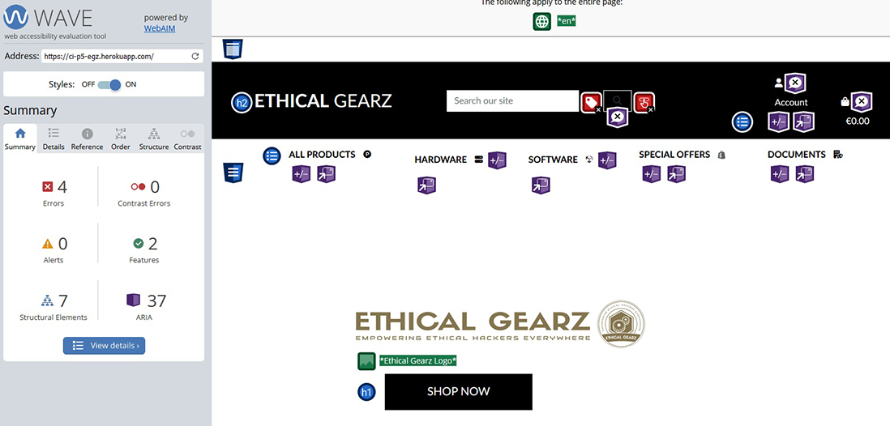
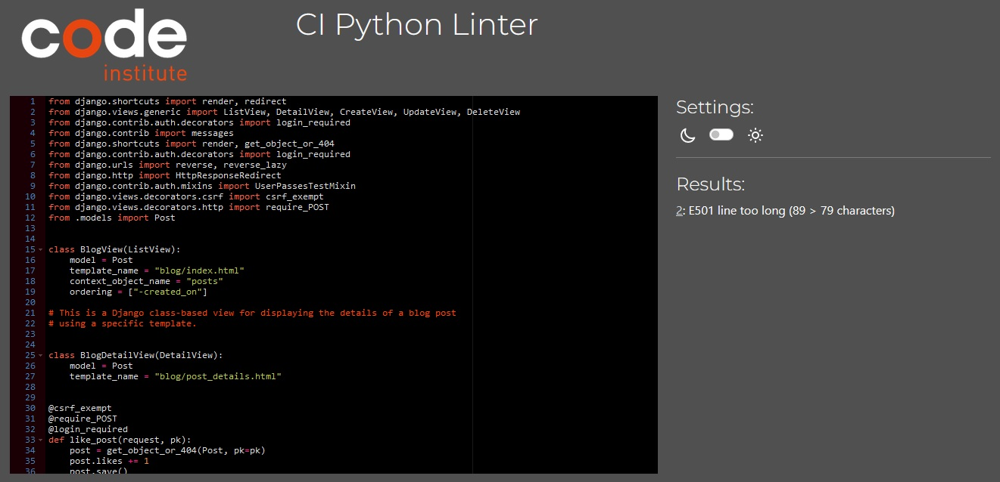
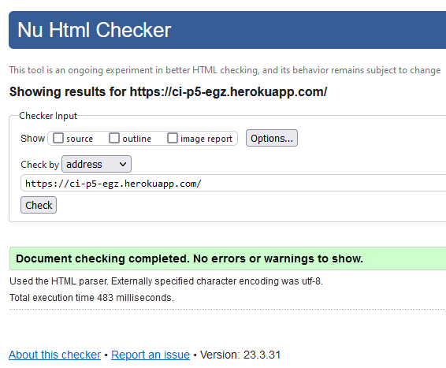
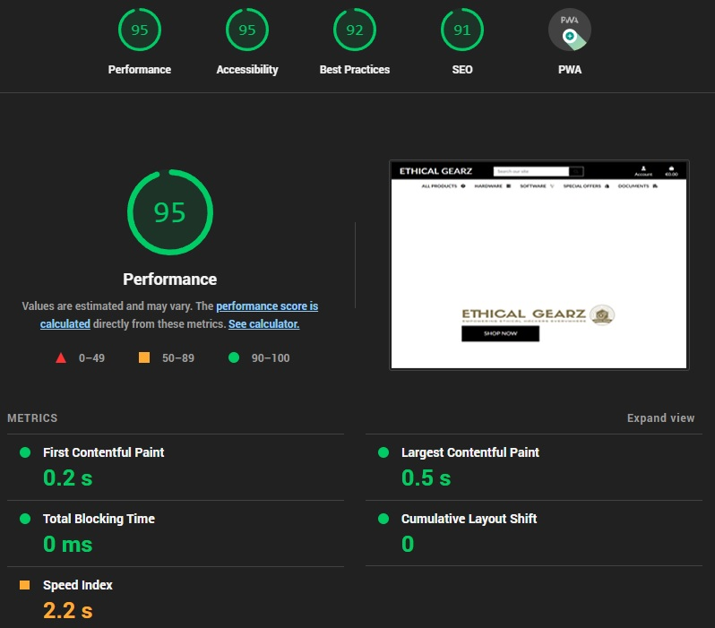
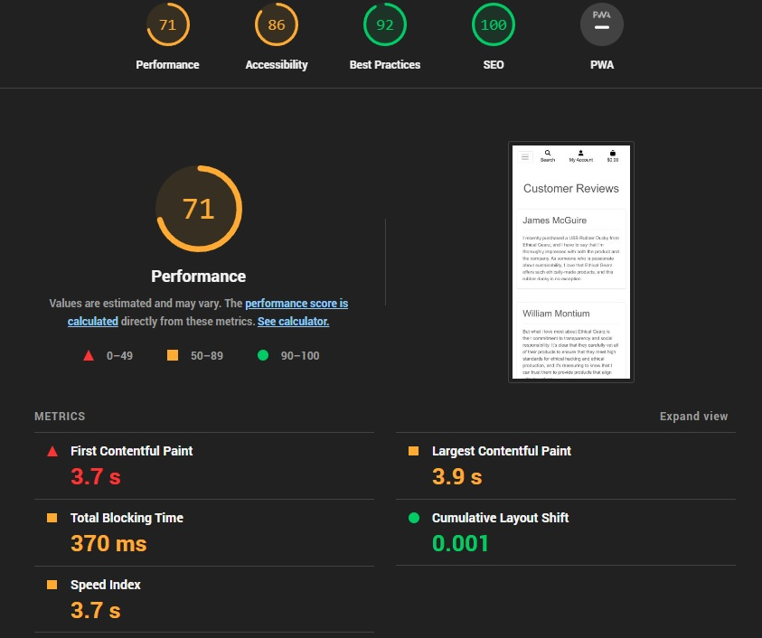

# Functional Testing

## Authentication

Description:

Ensure a user can register on the store.

Steps:

1. Navigate to [Ethical Gearz](https://ci-p5-egz.herokuapp.com/) and click Register
2. Enter email, username and password
3. Click Register

Expected:

The user is directed to a verify email messagen after entering suitable email, username and password, registration is successful after verifying email.

Actual:

The user was directed to a verify email messagen after entering suitable email, username and password, registration was successful after verifying email.

Description:

Ensure a user can log in to the store.

Steps:

1. Navigate to [Ethical Gearz](https://ci-p5-egz.herokuapp.com/) and click Login
2. Enter login details created during registration
3. Click sign in

Expected:

User is successfully logged in and redirected to the home page.

Actual:

User is successfully logged in and redirected to the home page.

Description:

Ensure a user can log out of the store.

Steps:

1. Log in to the store
2. Click the logout button
3. Click confirm on the confirm sign out page

Expected:

User is logged out

Actual:

User is logged out

Description:

Ensure a user can log in with the correct credentials

Steps:

1. Navigate to [Ethical Gearz](https://ci-p5-egz.herokuapp.com/) and click Login
2. Enter login details for account (username: backupadmin, password )
3. Click sign in

Expected:

User is successfully logged in and redirected to the home page

Actual:

User is successfully logged in and redirected to the home page

## Navigation Links

Testing was performed to ensure all navigation links on the respective pages, navigated to the correct pages as per design. This was done by clicking on the navigation links on each page.

Description:

Ensure a user can navigate to the relevant page, including not logged in users, standard users, and superusers

Steps:

Click on the different navigations link in the navigation bar

Expected:

The user is directed to the relevant page, either redirecting to the login page for protected pages or displaying a 403 error.

Actual:

The user was directed to the relevant page, redirected to the login page for protected pages and displayed a 403 error.

## Product Purchase

Testing was performed to ensure a user can successfully buy a product from the store. The steps include logging in, selecting a product, customizing the order, clicking checkout, entering in details, entering credit card information, and receiving an order confirmation email.

Description:

Ensure a user can buy a product from the store and receive an order confirmation email.

Steps:

1. Log in to the store
2. Browse products and select a product to purchase
3. Customize the order (if applicable)
4. Click on the checkout button
5. Enter shipping and billing details
6. Enter credit card information
7. Click on the purchase button
8. Check for order confirmation email

Expected:

1. User is able to log in to the store
2. User is able to select a product to purchase
3. User is able to customize the order (if applicable)
4. User is directed to the checkout page
5. User is able to enter shipping and billing details
6. User is able to enter credit card information
7. User is able to complete the purchase
8. User receives an order confirmation email

Actual:

1. User was able to log in to the store
2. User was able to select a product to purchase
3. User was able to customize the order (if applicable)
4. User was directed to the checkout page
5. User was able to enter shipping and billing details
6. User was able to enter credit card information
7. User was able to complete the purchase
8. User received an order confirmation email.

## Blog Section

Testing was performed to ensure the blog section of the site functions as intended. The tests include user and admin actions such as reading blogs, creating, reading, updating, and deleting posts using the product management section.

Description:

Ensure users can read blogs and the admin can manage posts using the post management section.

Steps:

1. Navigate to the blog section of the site
2. Read a blog post
3. Log in as an admin
4. Navigate to the post management section
5. Create a new blog post
6. Read a blog post
7. Update a blog post
8. Delete a blog post

Expected:

1. User can navigate to the blog section of the site
2. User can read a blog post
3. Admin can log in to the site
4. Admin can navigate to the post management section
5. Admin can create a new blog post
6. User can read a blog post
7. Admin can update a blog post
8. Admin can delete a blog post

Actual:

1. User was able to navigate to the blog section of the site
2. User was able to read a blog post
3. Admin was able to log in to the site
4. Admin was able to navigate to the post management section
5. Admin was able to create a new blog post
6. User was able to read a blog post
7. Admin was able to update a blog post
8. Admin was able to delete a blog post.

## Reviews Section

Testing was performed to ensure the reviews section of the site functions as intended. The tests include user and admin actions such as reading approved reviews, adding reviews, creating, reading, updating, and deleting reviews as an admin, and testing that approved reviews are displayed.

Description:

Ensure users can read approved reviews, add reviews, and that admins can manage reviews.

Steps:

1. Navigate to the reviews section of the site
2. Read an approved review
3. Add a review
4. Log in as an admin
5. Navigate to the review management section
6. Create a new review
7. Read a review
8. Update a review
9. Delete a review
10. Approve a review
11. Verify that approved reviews are displayed

Expected:

1. User can navigate to the reviews section of the site
2. User can read an approved review
3. User can add a review
4. Admin can log in to the site
5. Admin can navigate to the review management section
6. Admin can create a new review
7. User can read a review
8. Admin can update a review
9. Admin can delete a review
10. Admin can approve a review
11. Approved reviews are displayed for users to read

Actual:

1. User was able to navigate to the reviews section of the site
2. User was able to read an approved review
3. User was able to add a review
4. Admin was able to log in to the site
5. Admin was able to navigate to the review management section
6. Admin was able to create a new review
7. User was able to read a review
8. Admin was able to update a review
9. Admin was able to delete a review
10. Admin was able to approve a review
11. Approved reviews were displayed for users to read.

## Newsletter Section

Testing was performed to ensure the newsletter section of the site functions as intended. The tests include user and admin actions such as submitting an email address, checking if the email is already in the database, adding new emails to the database, and managing emails using django admin as an admin.

Description:

Ensure users can submit an email address for the newsletter and admins can manage email addresses using the product management section.

Steps:

1. Navigate to the newsletter section of the site
2. Enter an email address
3. Submit the email address
4. Verify if the email address is already in the database
5. If not, add the email address to the database
6. Log in as an admin
7. Navigate to django admin
8. Create a new email address
9. Read an email address
10. Update an email address
11. Delete an email address

Expected:

1. User can navigate to the newsletter section of the site
2. User can enter an email address
3. User can submit the email address
4. System verifies if the email address is already in the database
5. If not, system adds the email address to the database
6. Admin can log in to the site
7. Admin can navigate to django admin
8. Admin can create a new email address
9. User can read an email address
10. Admin can update an email address
11. Admin can delete an email address

Actual:

1. User was able to navigate to the newsletter section of the site
2. User was able to enter an email address
3. User was able to submit the email address
4. System verified if the email address is already in the database
5. If not, system added the email address to the database
6. Admin was able to log in to the site
7. Admin was able to navigate to django admin
8. Admin was able to create a new email address
9. User was able to read an email address
10. Admin was able to update an email address
11. Admin was able to delete an email address.

## Product Admin Section

Testing was performed to ensure the Product Admin section of the site functions as intended. The tests include admin actions such as creating, reading, updating, and deleting products, including name, price, category, rating, image, and SKU. The tests also verify that standard users can see products in the correct categories and search, sort, and filter products based on various criteria.

Description:

Ensure admins can manage products using the Product Admin section of the site and that standard users can view products in the correct categories, and search, sort, and filter products based on various criteria.

Steps:

1. Log in as an admin
2. Navigate to the Product Admin section
3. Create a new product with name, price, category, rating, image, and SKU
4. Read a product
5. Update a product
6. Delete a product
7. Log out as admin
8. Log in as a standard user
9. Navigate to the Products section
10. Verify that products are displayed in the correct categories
11. Search for a product by name, or category
12. Sort products by name, price, rating, or category
13. Filter products by category or rating

Expected:

1. Admin can log in to the site
2. Admin can navigate to the Product Admin section
3. Admin can create a new product with name, price, category, rating, image, and SKU
4. User can read a product
5. Admin can update a product
6. Admin can delete a product
7. Admin can log out
8. Standard user can log in to the site
9. Standard user can navigate to the Products section
10. Products are displayed in the correct categories for the standard user to view.
11. User can search for a product by name and category
12. User can sort products by name, price, rating, or category
13. User can filter products by category or rating.

Actual:

1. Admin was able to log in to the site
2. Admin was able to navigate to the Product Admin section
3. Admin was able to create a new product with name, price, category, rating, image, and SKU
4. User was able to read a product
5. Admin was able to update a product
6. Admin was able to delete a product
7. Admin was able to log out
8. Standard user was able to log in to the site
9. Standard user was able to navigate to the Products section
10. Products were displayed in the correct categories for the standard user to view.
11. User was able to search for a product by name and category
12. User was able to sort products by name, price, rating, or category
13. User was able to filter products by category or rating.

## Contact Us Section

Testing was performed to ensure the Contact Us section of the site functions as intended. The tests include user and admin actions such as submitting and managing messages using django admin as an admin.

Description:

Ensure users can submit a message to the site's owners, and admins can manage messages using django admin.

Steps:

1. Navigate to the Contact Us section of the site
2. Fill out the message form and submit the message
3. Verify that the thank you message was sent successfully
4. Log in as an admin
5. Navigate to django admin
6. Create a new message
7. Read a message
8. Update a message
9. Delete a message

Expected:

1. User can navigate to the Contact Us section of the site
2. User can fill out the message form and submit the message
3. User receives a thank you confirmation that the message was sent successfully
4. Admin can log in to django admin
5. Admin can navigate to django admin
6. Admin can create a new message
7. Admin can read a message
8. Admin can update a message
9. Admin can delete a message

Actual:

1. User was able to navigate to the Contact Us section of the site
2. User was able to fill out the message form and submit the message
3. User received a thank you confirmation that the message was sent successfully
4. Admin was able to log in to django admin
5. Admin was able to navigate to the message section
6. Admin was able to create a new message
7. Admin was able to read a message
8. Admin was able to update a message
9. Admin was able to delete a message.

## Protected Pages

Testing was performed to ensure coded restriction are functional, in all the CRUD functionality including Product, Blog and Rewiews admin section.

Description:

Ensure coded restriction is functional.

Steps:

1. Open the website and navigate to the login page.
2. Attempt to access a view protected by coded restriction, such as the product creation page in the product admin section.
3. Verify that the user is redirected to the login page and cannot access the protected view.
4. Log in as a non-staff user and attempt to access the protected view again.
5. Verify that the user can still not access the protected view.
6. Log in as a staff user and attempt to access the protected view again.
7. Verify that the user can now access the protected view.
8. Log in as a superuser and attempt to access the protected view again.
9. Verify that the superuser can access the protected view as well.
10. Test that the user can perform the expected CRUD operations on posts likes in the blog section.
11. Test that the user can like the posts if authenticated only in the blogs section.
12. Test that only staff and superusers can perform the CRUD operations on posts and likes in the posts admin section.
13. Repeat steps 2-12 for the review and product admin sections.

Expected:

The coded restriction protects views from unauthorized access, allowing only staff and superusers to access particular views in the admin sections. Users can perform CRUD operations on likes if they are authenticated, while only staff and superusers have CRUD permissions in the admin sections.

Actual:

The coded restriction is functional, protecting views from unauthorized access and allowing only authorized users to access particular views in the admin sections. Users can perform CRUD operations on likes if they are authenticated, while only staff and superusers have CRUD permissions in the admin sections.

## Responsiveness

Pages were tested on various screen sizes from 320px on a Samsung fold 2, Samsung Galaxy Tab, Nexus 7 and a wide screen Windows machine.

Pages were tested on most modern browsers, including Microsoft Edge, Chrome, Firefox, Opera and Brave.

Test Steps:

1. Open the corresponding browser and open the Ethical Gearz website.
2. Open the browser development tools by hitting the corresponding dev tools shortcut.
3. Resize to the desired width.
4. Click and drag the browser window to lower or larger window size.

Expected:

The store is responsive on all sizes, and no pixelation is accruing. No overlap of text or images.

Actual:

The store behaved as expected, with an some issues with the size of the product store images on smaller screens.

The store was tested on the following physical devices, with no resizing issues seen:

    Samsung fold 2
    Samsung Galaxy Tab
    Nexus 7 with Kali Linux
    Widescreen 4k monitor

The store was tested on the following screen sizes using Chrome Dev tools, Media Genius and Unicorn Revealer:

    iPhone SE
    iPhone XR
    iPhone 12 PRO
    Pixel 5
    Samsung Galaxy S8+
    Samsung Galaxy S20 Ultra
    iPad Air
    iPad Mini
    Surface Pro 7
    Surface Duo
    Samsung Galaxy A51/71
    Nest Hub
    Nest Hub Max

## Accessibility

The store was designed to provide optimal viewing experience across different screen sizes and resolutions.

During the development process, the *[WAVE Evaluation Website](https://wave.webaim.org/report#/https://ci-p5-egz.herokuapp.com/)*  tool was used to ensure the highest level of accessibility in accordance with the Web Content Accessibility Guidelines (WCAG).

## Validator Testing

All pages were run through the *[CI Pep8 Validator](https://pep8ci.herokuapp.com/)* to ensure that all code was Pep8 compliant. Used Black Python Code Validator to fix issues.

Errors were displayed as a result of blank spacing and overly long lines.

All of these errors were corrected, with the exception of the some of the variables in python files.

## HTML

On all pages, the *[w3 HTML Validator](https://validator.w3.org/)* was used. Initially, there were a few errors due to stray script tags,
incorrect use of headings inside spans, and some indentation elements such as div tags which were mostly fixed.

Because of the django structure - directing language code used in the HTML files, which cannot be easily copy and pasted into the validator, pages with login required or a secured view could be validated by direct URI.

To test the file validation, open the page to be checked, right-click, and select View Page Source from the menu that appears.
Because of validator will only accept HTML rendered code, paste the raw HTML code into it.

## Lighthouse Testing

### Desktop Testing

Desktop Lighthouse testing is showing a perfect score of 95, with SEO of 91 seo.

### Mobile Testing

Mobile Lighthouse Testing is showing a score of 71 due to image sizes and stripe, with SEO of 100.

## Bugs

* Used *[StackOverFlow](https://stackoverflow.com/questions/70466886/typeerror-init-got-an-unexpected-keyword-argument-providing-args)* to fix allauth version error, which required an upgrade to allauth 0.51.0

* Used *[StackOverFlow](https://stackoverflow.com/questions/70285834/forbidden-403-csrf-verification-failed-request-aborted-reason-given-for-fail/70326426#70326426)* to fix csrf verification error to login to django admin site, which required adding CSRF_TRUSTED_ORIGINS in settings.py file.

* Bug with AWS S3, when uploading an image in the Product Admin section, and after the static migration, S3 requires modification of the ACL to public to allow the image to be displayed and the static files to show, added cloudinary link to static base.css as a short term fix for the stores styling. I have opened a support case with Amazon on this issue.
